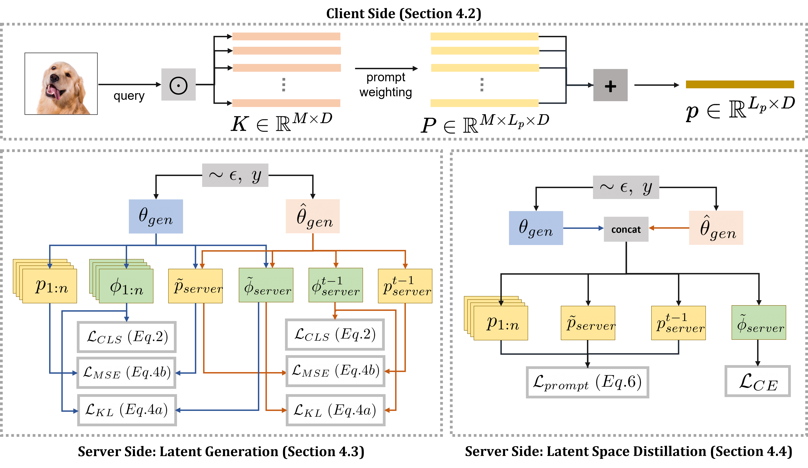

# Continual Adaptation of Vision Transformers for Federated Learning

[TMLR 2024 Paper Link](https://arxiv.org/pdf/2306.09970.pdf) | [NeurIPSW-2023 Talk](https://neurips.cc/virtual/2023/79009)

This repository contains code for our paper <b>HePCo: Continual Adaptation of Foundation Models for Federated Learning</b> which appeared at <b>Transactions on Machine Learning Research (TMLR) 2024</b>. HePCo is a parameter-efficient approach to continually adapt foundation models at the edge for federated learning.

<p align="center">
    
    <br />
  <a href="./LICENSE"></a>
  <a href="Python 3.7"></a>
  <a href="https://github.com/psf/black"></a>
</p>
In this paper, we focus on the important yet understudied problem of Continual Federated Learning (CFL), where a server communicates with a set of clients to incrementally learn new concepts over time without sharing or storing any data. The complexity of this problem is compounded by challenges from both the Continual and Federated Learning perspectives. Specifically, models trained in a CFL setup suffer from catastrophic forgetting which is exacerbated by data heterogeneity across clients.  Existing attempts at this problem tend to impose large overheads on clients and communication channels or require access to stored data which renders them unsuitable for real-world use due to privacy. In this paper, we attempt to tackle forgetting and heterogeneity while minimizing overhead costs and without requiring access to any stored data. We study this problem in the context of Foundation Models and explore parameter-efficient approaches to adapt to dynamic distributions while minimizing forgetting. We achieve this by leveraging a prompting based approach (such that only prompts and classifier heads have to be communicated) and proposing a novel and lightweight generation and distillation scheme to consolidate client models at the server. We formulate this problem for image classification and establish strong baselines for comparison, conduct experiments on CIFAR-100 as well as challenging, large-scale datasets like ImageNet-R and DomainNet. Our approach outperforms both existing methods and our own baselines by as much as 7% while significantly reducing communication and client-level computation costs.

## Setup
 * Initialize conda environment from provided file: `conda env create -f hepco_env.yml`
 * Activate the environment: `conda activate cl`

## Datasets
 * Create a folder named `data/`
 * Get [ImageNet-R](https://github.com/hendrycks/imagenet-r), [DomainNet](http://ai.bu.edu/M3SDA/) datasets and put in data/imagenet-r and data/domainnet

## Training
Run the following command from the base directory. This code assumes a 2 GPU setup.
 ```bash
    sh experiments/cifar-r-hepco1.sh
 ```
 Replace the dataset name to run on `imagenet-r` and `domainnet`.

## Citing HePCo
If you use HePCo in your research, please cite [the following paper](https://arxiv.org/pdf/2306.09970.pdf):

```bibtex
@misc{halbe2023hepcodatafreeheterogeneousprompt,
      title={HePCo: Data-Free Heterogeneous Prompt Consolidation for Continual Federated Learning}, 
      author={Shaunak Halbe and James Seale Smith and Junjiao Tian and Zsolt Kira},
      year={2023},
      eprint={2306.09970},
      archivePrefix={arXiv},
      primaryClass={cs.CV},
      url={https://arxiv.org/abs/2306.09970}, 
}
``` 
## Acknowledgements
 * This code is built upon the implementation from [CODA-Prompt](https://github.com/GT-RIPL/CODA-Prompt)
